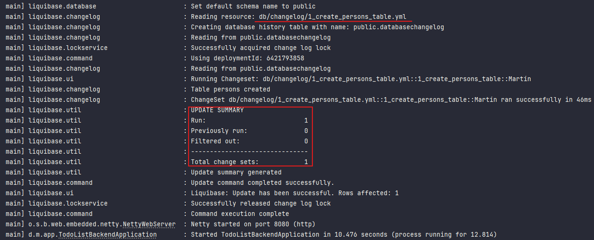

# [Programación reactiva con Spring Data R2DBC](https://medium.com/pictet-technologies-blog/reactive-programming-with-spring-data-r2dbc-ee9f1c24848b)

- Tutorial tomado de la página `Medium` del autor `Alexandre Jacquot`.
- Repositorio del tutorial
  [reactive-todo-list-r2dbc](https://github.com/pictet-technologies-open-source/reactive-todo-list-r2dbc)

---

Cómo construir una aplicación web colaborativa con `Angular`, `Spring Boot`, `Spring WebFlux`, `Spring Data R2DBC` y
`PostgreSQL`.

En un tutorial anterior del mismo autor trabajamos en una aplicación, misma que está en el siguiente repositorio
[webflux-angular-mongodb](https://github.com/magadiflo/webflux-angular-mongodb), donde solo usamos un tipo de
objeto de dominio. Por lo tanto, todas las operaciones relacionadas con la capa de acceso a datos procesaban un solo
documento a la vez. Este era un caso de uso ideal para la programación reactiva, pero **¿qué pasaría si introdujéramos
relaciones entre objetos?** Construir un objeto y tener que recuperar sus objetos relacionados antes de poder enviarlo
de vuelta no parece cumplir con la especificación de `Reactive Streams`. Además, **¿cómo podemos manejar correctamente
las transacciones cuando los datos se guardan mediante varios subprocesos? ¿Seguirá siendo posible la programación
reactiva o será necesario volver a la programación imperativa?**

En este artículo, intentaremos responder a todas estas preguntas. Actualizaremos nuestra aplicación web colaborativa y
utilizaremos una base de datos relacional. Lo construiremos con `Angular`, `Spring Boot`, `Spring WebFlux`,
`Spring Data R2DBC` y `PostgreSQL`. Para hacer frente a las modificaciones concurrentes utilizaremos el
`bloqueo optimista`, los `eventos` enviados por el servidor y el `sistema de notificaciones PostgreSQL`.

---

## R2DBC (Reactive Relational Database Connectivity)

La documentación oficial dice lo siguiente:

- `Basado en la especificación Reactive Streams`. `R2DBC` se basa en la especificación Reactive Streams, que proporciona
  una API no bloqueante y totalmente reactiva.


- `Funciona con bases de datos relacionales`. A diferencia de la naturaleza bloqueante de `JDBC`, `R2DBC` le permite
  trabajar con bases de datos SQL mediante una API reactiva.


- `Admite soluciones escalables`. Con `Reactive Streams`, `R2DBC` le permite pasar del modelo clásico de
  `un hilo por conexión` a un enfoque más potente y escalable.


- `Proporciona una especificación abierta`. `R2DBC` es una especificación abierta y establece una interfaz de proveedor
  de servicios (SPI) para que los proveedores de controladores implementen y los clientes consuman.

## Crea contenedor de PostgreSQL con Docker Compose

Para almacenar nuestros datos, utilizaremos `PostgreSQL`. Nuestro primer paso consiste en configurar una instancia local
de `PostgreSQL` usando `Docker Compose`. Para ello, necesitamos crear el siguiente archivo `compose.yml`.

````yml
services:
  postgres:
    image: postgres:15.2-alpine
    container_name: c-postgres
    restart: unless-stopped
    environment:
      POSTGRES_DB: db_webflux_angular_r2dbc
      POSTGRES_USER: magadiflo
      POSTGRES_PASSWORD: magadiflo
    ports:
      - '5433:5432'
    volumes:
      - postgres_data:/var/lib/postgresql/data

volumes:
  postgres_data:
    name: postgres_data
````

Como se observa en el archivo anterior, estamos creando un servicio de postgres que creará nuestro contenedor. En el
tutorial define otro servicio para crear una instancia de `PgAdmin`, en nuestro caso no lo requerimos, dado que
usaré `DBeaver` que ya tengo instalada en mi pc, para interactuar con la base de datos de postgres.

Iniciamos el contenedor ejecutamos el siguiente comando en la misma carpeta del archivo `compose.yml` y luego
verificamos que el contenedor se haya creado.

````bash
$ docker compose up -d                           
 
$ docker container ls -a
CONTAINER ID   IMAGE                  COMMAND                  CREATED          STATUS                           PORTS                    NAMES
5ad2963bd825   postgres:15.2-alpine   "docker-entrypoint.s…"   33 seconds ago   Up 31 seconds                    0.0.0.0:5433->5432/tcp   c-postgres
````

Ahora, usando `DBeaver` nos conectamos a la base de datos de `PostgresSQL` que está corriendo en su propio contenedor de
docker.


## Crea una aplicación web reactiva con Spring Data R2DBC

Para demostrar cómo lidiar con las relaciones en la programación reactiva, necesitamos enriquecer nuestro modelo de
datos. En la versión anterior de nuestra aplicación, los usuarios podían trabajar juntos en una lista de tareas
compartida. Podrían realizar las siguientes acciones:

- Agregar un item a la lista compartida.
- Editar la descripción de un item.
- Cambiar el estado de un item.
- Eliminar un item.

En la nueva versión que vamos a desarrollar, también van a poder editar los ítems con el fin de:

- Definir una persona asignada (opcional)
- Definir un conjunto de etiquetas como `Private`, `Sport`, `Work`, etc. (0 a n elementos)

## Agrega proyecto de Spring Boot WebFlux

Utilizando la página de `spring initializr` creamos el proyecto de `Spring Boot` con las siguientes dependencias.

````xml

<project>
    <!--Spring Boot 3.3.3-->
    <!--java.version 21-->
    <!--org.mapstruct.version 1.6.0-->
    <!--lombok-mapstruct-binding.version 0.2.0-->
    <dependencies>
        <dependency>
            <groupId>org.springframework.boot</groupId>
            <artifactId>spring-boot-starter-data-r2dbc</artifactId>
        </dependency>
        <dependency>
            <groupId>org.springframework.boot</groupId>
            <artifactId>spring-boot-starter-validation</artifactId>
        </dependency>
        <dependency>
            <groupId>org.springframework.boot</groupId>
            <artifactId>spring-boot-starter-webflux</artifactId>
        </dependency>
        <dependency>
            <groupId>org.liquibase</groupId>
            <artifactId>liquibase-core</artifactId>
        </dependency>
        <dependency>
            <groupId>org.springframework</groupId>
            <artifactId>spring-jdbc</artifactId>
        </dependency>

        <!--Agregado manualmente-->
        <dependency>
            <groupId>org.mapstruct</groupId>
            <artifactId>mapstruct</artifactId>
            <version>${org.mapstruct.version}</version>
        </dependency>
        <dependency>
            <groupId>org.springdoc</groupId>
            <artifactId>springdoc-openapi-starter-webflux-ui</artifactId>
            <version>2.6.0</version>
        </dependency>
        <!--/Agregado manualmente-->

        <dependency>
            <groupId>org.postgresql</groupId>
            <artifactId>postgresql</artifactId>
            <scope>runtime</scope>
        </dependency>
        <dependency>
            <groupId>org.postgresql</groupId>
            <artifactId>r2dbc-postgresql</artifactId>
            <scope>runtime</scope>
        </dependency>
        <dependency>
            <groupId>org.projectlombok</groupId>
            <artifactId>lombok</artifactId>
            <optional>true</optional>
        </dependency>
        <dependency>
            <groupId>org.springframework.boot</groupId>
            <artifactId>spring-boot-starter-test</artifactId>
            <scope>test</scope>
        </dependency>
        <dependency>
            <groupId>io.projectreactor</groupId>
            <artifactId>reactor-test</artifactId>
            <scope>test</scope>
        </dependency>
    </dependencies>

    <build>
        <plugins>
            <plugin>
                <groupId>org.springframework.boot</groupId>
                <artifactId>spring-boot-maven-plugin</artifactId>
                <configuration>
                    <excludes>
                        <exclude>
                            <groupId>org.projectlombok</groupId>
                            <artifactId>lombok</artifactId>
                        </exclude>
                    </excludes>
                </configuration>
            </plugin>
            <!--MapStruct-->
            <plugin>
                <groupId>org.apache.maven.plugins</groupId>
                <artifactId>maven-compiler-plugin</artifactId>
                <version>${maven-compiler-plugin.version}</version>
                <configuration>
                    <source>${java.version}</source>
                    <target>${java.version}</target>
                    <annotationProcessorPaths>
                        <path>
                            <groupId>org.mapstruct</groupId>
                            <artifactId>mapstruct-processor</artifactId>
                            <version>${org.mapstruct.version}</version>
                        </path>
                        <path>
                            <groupId>org.projectlombok</groupId>
                            <artifactId>lombok</artifactId>
                            <version>${lombok.version}</version>
                        </path>
                        <path>
                            <groupId>org.projectlombok</groupId>
                            <artifactId>lombok-mapstruct-binding</artifactId>
                            <version>${lombok-mapstruct-binding.version}</version>
                        </path>
                    </annotationProcessorPaths>
                </configuration>
            </plugin>
            <!--/MapStruct-->
        </plugins>
    </build>

</project>
````

Notar que he agregado manualmente la dependencia de `MapStruct` y de `Swagger (OpenAPI)`. Con respecto a la dependencia
de `MapStruct`, ha sido necesario la configuración del plugin de `maven-compiler-plugin`. Para mayor información
sobre el porqué de esta configuración visitar el repositorio
[webflux-angular-mongodb](https://github.com/magadiflo/webflux-angular-mongodb/blob/main/README.md).

## El modelo de datos

Vamos a crear las distintas entidades que utilizaremos en este proyecto.

````java

@ToString
@AllArgsConstructor
@NoArgsConstructor
@Builder
@Setter
@Getter
@Table(name = "items")
public class Item {
    @Id
    private Long id;
    private String description;
    @Builder.Default
    private ItemStatus status = ItemStatus.TO_DO;
    private Long assigneeId;

    @Transient
    private Person assignee;
    @Transient
    private List<Tag> tags;

    @Version
    private Long version;
    @CreatedDate
    private LocalDateTime createdDate;
    @LastModifiedDate
    private LocalDateTime lastModifiedDate;
}
````

````java
public enum ItemStatus {
    TO_DO,
    IN_PROGRESS,
    DONE
}
````

````java

@ToString
@AllArgsConstructor
@NoArgsConstructor
@Builder
@Setter
@Getter
@Table(name = "persons")
public class Person {
    @Id
    private Long id;
    private String firstName;
    private String lastName;

    @Version
    private Long version;
    @CreatedDate
    private LocalDateTime createdDate;
    @LastModifiedDate
    private LocalDateTime lastModifiedDate;
}
````

````java

@ToString
@AllArgsConstructor
@NoArgsConstructor
@Builder
@Setter
@Getter
@Table(name = "tags")
public class Tag {
    @Id
    private Long id;
    private String name;

    @Version
    private Long version;
    @CreatedDate
    private LocalDateTime createdDate;
    @LastModifiedDate
    private LocalDateTime lastModifiedDate;
}
````

````java

@ToString
@AllArgsConstructor
@NoArgsConstructor
@Builder
@Setter
@Getter
@Table(name = "items_tags")
public class ItemTag {
    @Id
    private Long id;
    private Long itemId;
    private Long tagId;
}
````

Lo primero que hay que notar es el uso de la anotación `@Table`. Aunque no es obligatorio anotar nuestros objetos de
dominio, no hacerlo afectaría el rendimiento. En realidad, esta anotación es utilizada por el marco de mapeo para
preprocesar los objetos de dominio con el fin de extraer los metadatos necesarios para interactuar con la base de datos.

Otra anotación importante es `@Id`. Se utiliza para mapear un campo de clase a la `clave primaria de la tabla`. Tenga
en cuenta que, con `Spring Data R2DBC`, no hay generación automática de identificadores únicos. Ni siquiera podemos
especificar una estrategia de generación. Para resolver este problema, simplemente podemos indicarle a `PostgreSQL` que
genere automáticamente el `ID` cuando se crea un registro utilizando el tipo de datos `BIGSERIAL` (porque usamos Long,
si usáramos Integer usaríamos el SERIAL).

Además, `Spring Data R2DBC no admite identificadores embebidos`. En otras palabras, no podemos definir una clave
principal compuesta. Esta limitación es bastante molesta porque nos obliga a utilizar un ID único generado en su lugar
y esto tiene un impacto directo en la cantidad de código que necesitamos escribir. Verá este impacto con más detalle
cuando guardemos algunos registros en la tabla `item_tags`. Esta tabla, que se utiliza para representar la relación
de `muchos a muchos` entre `items` y `tags`, tiene una clave técnica, mientras que podríamos haber utilizado el ID del
item y el ID del tag como clave principal compuesta.

Las entidades `Item`, `Person` y `Tag` tienen la anotación `@Version` sobre un campo de tipo `Long`. Esta anotación
es totalmente compatible y viene con un mecanismo de `bloqueo optimista`. Cada vez que se va a guardar un registro, se
compara la versión actual del registro con la proporcionada y, si son idénticas, se incrementa la versión y se guarda el
registro. Si son diferentes, el registro no se guarda y se devuelve un error.

Las anotaciones de auditoría como `@CreatedDate` o `@LastModifiedDate` también son compatibles. Para habilitar la
función de auditoría, debemos declararla explícitamente con la anotación `@EnableR2dbcAuditing`. Podemos, por ejemplo,
agregarla sobre la clase principal de la aplicación.

````java

@EnableR2dbcAuditing
@SpringBootApplication
public class TodoListBackendApplication {
    public static void main(String[] args) {
        SpringApplication.run(TodoListBackendApplication.class, args);
    }
}
````

Un aspecto muy importante que hay que tener en cuenta antes de decidirse a utilizar `Spring Data R2DBC` es la falta de
compatibilidad con relaciones. A diferencia de `Spring Data JPA`, no es posible utilizar un marco `ORM` avanzado como
Hibernate. `Spring Data R2DBC` es un mapeador de objetos simple y limitado. Como consecuencia, muchas de las funciones
que suelen ofrecer los marcos ORM no están disponibles, como, por ejemplo, el almacenamiento en caché o la carga
diferida. Como los objetos relacionados no se pueden mapear automáticamente, los campos `assignee` y `tags` deben
anotarse con `@Transient` para indicarle al marco de mapeo que los ignore. En la siguiente sección, veremos cómo
mapear estos objetos.

## [Versionado de base de datos con Liquibase](https://github.com/magadiflo/spring-boot-liquibase/blob/main/README.md)

Por último, pero no por ello menos importante, `el esquema de la base de datos no se puede crear automáticamente en
función de los objetos del dominio`. Para superar este problema, podemos utilizar `Liquibase` para crear y mantener
nuestro esquema.

Recordemos que cuando creamos el proyecto, agregamos la dependencia de `Spring Data R2DBC`. Ahora, adicionalmente
agregamos la dependencia de `Liquibase` y en automático se nos agrega la dependencia `spring-jdbc`, es porque
`Liquibase`, por defecto, utiliza `JDBC` para interactuar con la base de datos. Aunque estemos utilizando
`Spring Data R2DBC` para operaciones reactivas, `Liquibase` aún requiere `JDBC` para ejecutar sus scripts de migración
de base de datos.

`Spring Data R2DBC` y `Spring WebFlux` están diseñados para operaciones reactivas y no bloqueantes, pero `Liquibase` no
tiene soporte nativo para `R2DBC` y depende de `JDBC` para sus operaciones. Por eso, al agregar `Liquibase` a tu
proyecto, también se agrega `spring-jdbc` como dependencia.

````xml

<dependencies>
    <dependency>
        <groupId>org.liquibase</groupId>
        <artifactId>liquibase-core</artifactId>
    </dependency>
    <dependency>
        <groupId>org.springframework</groupId>
        <artifactId>spring-jdbc</artifactId>
    </dependency>
</dependencies>
````

Otro punto importante es que cuando generamos el proyecto agregando la dependencia de `Liquibase` desde
`Spring Initializr`, se nos crea el directorio `src/main/resources/db/changelog`. Este directorio será el que usaremos
para crear nuestros archivos de migración.

Iniciemos creando un archivo maestro llamado `db.changelog-master.yml`, será el que hará referencia a todos los archivos
de `changeLog` en el orden adecuado. Estos archivos `changeLog` estarán ubicados en el directorio definido en el `path`.
El contenido y la ubicación de este archivo será el siguiente:

````yml
# src/main/resources/db/db.changelog-master.yml
databaseChangeLog:
  - includeAll:
      path: /db/changelog/
````

Dentro del directorio `/db/changelog/` crearemos nuestra primera migración. El archivo que crearemos tendrá una
nomenclatura propia, es decir `<migration_number>_<what_does_this_migration_do>.yml`.

El `changeSet` que crearemos con esta migración será crear la tabla `persons` en la base de datos. Para eso, tomando
como referencia nuestra entidad `Person`, agregamos las configuraciones necesarias para crear la tabla.

El archivo changeLog que crearemos para esta migración se llamará `1_create_persons_table.yml`.

````yml
databaseChangeLog:
  - changeSet:
      id: 1_create_persons_table
      author: Martín
      changes:
        - createTable:
            tableName: persons
            columns:
              - column:
                  name: id
                  type: BIGINT
                  autoIncrement: true
                  constraints:
                    primaryKey: true
                    nullable: false
              - column:
                  name: first_name
                  type: VARCHAR(100)
                  constraints:
                    nullable: false
              - column:
                  name: last_name
                  type: VARCHAR(100)
                  constraints:
                    nullable: false
              - column:
                  name: version
                  type: BIGINT
                  defaultValue: 0
                  constraints:
                    nullable: false
              - column:
                  name: created_date
                  type: TIMESTAMP
                  defaultValueComputed: CURRENT_TIMESTAMP
                  constraints:
                    nullable: false
              - column:
                  name: last_modified_date
                  type: TIMESTAMP
                  defaultValueComputed: CURRENT_TIMESTAMP
                  constraints:
                    nullable: false
````

Como último paso para ejecutar la aplicación y ver la creación de la tabla usando `Liquibase`, es precisamente
configurar `Liquibase` en el `application.yml`, donde le definiremos el archivo maestro y las propiedades de conexión
`jdbc` para conectarse a la base de datos.

A continuación, se muestra las propiedades completas definidas en el `application.yml` de nuestra aplicación.

````yml
server:
  port: 8080
  error:
    include-message: always

spring:
  application:
    name: todo-list-backend

  # Configuración de controlador R2DBC
  r2dbc:
    url: r2dbc:postgresql://localhost:5433/db_webflux_angular_r2dbc
    username: magadiflo
    password: magadiflo

  # Liquibase (Actualización de esquema)
  liquibase:
    change-log: classpath:/db/db.changelog-master.yml
    url: jdbc:postgresql://localhost:5433/db_webflux_angular_r2dbc
    user: magadiflo
    password: magadiflo

# Logging
logging:
  level:
    dev.magadiflo.app: DEBUG
    io.r2dbc.postgresql.QUERY: DEBUG
    io.r2dbc.postgresql.PARAM: DEBUG
````

## Ejecuta Primera Migración con Liquibase (Crea tabla persons)

Ahora que ya tenemos los archivos `changeLog` configurados correctamente y también las propiedades de configuración
para que `Liquibase` se ejecute sin problemas, vamos a levantar la aplicación y ver qué resultados obtenemos.

Como observamos en la siguiente imagen, se está ejecutando correctamente los archivos `changeLog` definidos.



Si revisamos la base de datos, vemos que nuestra tabla `persons` es creado correctamente, además `Liquibase` crea
automáticamente dos tablas: `DATABASECHANGELOG` y `DATABASECHANGELOGLOCK`. Estas tablas son esenciales
para el funcionamiento de `Liquibase`:

1. `DATABASECHANGELOG`: Esta tabla almacena un registro de todos los cambios (`changelogs`) que se han aplicado a la
   base de datos. Cada entrada incluye detalles como el autor del cambio, la fecha de aplicación y una descripción del
   cambio.


2. `DATABASECHANGELOGLOCK`: Esta tabla se utiliza para gestionar el control de concurrencia. Asegura que solo una
   instancia de `Liquibase` pueda aplicar cambios a la base de datos en un momento dado, evitando conflictos y problemas
   de sincronización.

Estas tablas permiten a `Liquibase` mantener un control preciso y ordenado de los cambios en la base de datos,
asegurando que todos los cambios se apliquen de manera correcta y en el orden adecuado.


## Crea tabla items y relaciona con persons

Basándonos en la entidad `Item` crearemos la tabla `items` y al final estableceremos la relación de clave foránea con
la tabla `persons`. El archivo `changeLog` que crearemos se llamará `2_create_items_table.yml`.

````yml
databaseChangeLog:
  - changeSet:
      id: 2_create_items_table
      author: Martín
      changes:
        - createTable:
            tableName: items
            columns:
              - column:
                  name: id
                  type: BIGINT
                  autoIncrement: true
                  constraints:
                    primaryKey: true
                    nullable: false
              - column:
                  name: description
                  type: VARCHAR(4000)
                  constraints:
                    nullable: false
              - column:
                  name: status
                  type: VARCHAR(15)
                  constraints:
                    nullable: false
              - column:
                  name: version
                  type: BIGINT
                  defaultValue: 0
                  constraints:
                    nullable: false
              - column:
                  name: created_date
                  type: TIMESTAMP
                  defaultValueComputed: CURRENT_TIMESTAMP
                  constraints:
                    nullable: false
              - column:
                  name: last_modified_date
                  type: TIMESTAMP
                  defaultValueComputed: CURRENT_TIMESTAMP
                  constraints:
                    nullable: false
              - column:
                  name: assignee_id
                  type: BIGINT
                  constraints:
                    foreignKeyName: fk_items_assignee_id
                    references: persons(id)
````

Ejecutamos la aplicación y vemos que la migración se efectúa creándose nuestra tabla `items` y su relación con la tabla
`persons`.


## Crea tabla tags

Creamos el archivo `changeLog` para crear la tabla de la entidad `Tag`. Este archivo lo llamaremos
`3_create_tags_table.yml`.

````yml
databaseChangeLog:
  - changeSet:
      id: 3_create_tags_table
      author: Martín
      changes:
        - createTable:
            tableName: tags
            columns:
              - column:
                  name: id
                  type: BIGINT
                  autoIncrement: true
                  constraints:
                    primaryKey: true
                    nullable: false
              - column:
                  name: name
                  type: VARCHAR(100)
                  constraints:
                    nullable: false
              - column:
                  name: version
                  type: BIGINT
                  defaultValue: 0
                  constraints:
                    nullable: false
              - column:
                  name: created_date
                  type: TIMESTAMP
                  defaultValueComputed: CURRENT_TIMESTAMP
                  constraints:
                    nullable: false
              - column:
                  name: last_modified_date
                  type: TIMESTAMP
                  defaultValueComputed: CURRENT_TIMESTAMP
                  constraints:
                    nullable: false
````

Si ejecutamos la aplicación veremos que la migración se efectúa sin problemas creándonos la tabla `tags`.


## Crea tabla items_tags y sus relaciones

Crearemos la tabla `items_tags` y la relacionaremos con las tablas `items` y `tags`. El `changeLog` que crearemos se
llamará `4_create_items_tags_table.yml`.

````yml
databaseChangeLog:
  - changeSet:
      id: 4_create_items_tags_table
      author: Martín
      changes:
        - createTable:
            tableName: items_tags
            columns:
              - column:
                  name: id
                  type: BIGINT
                  autoIncrement: true
                  constraints:
                    primaryKey: true
                    nullable: false
              - column:
                  name: item_id
                  type: BIGINT
                  constraints:
                    nullable: false
                    foreignKeyName: fk_items_tags_item_id
                    references: items(id)
              - column:
                  name: tag_id
                  type: BIGINT
                  constraints:
                    nullable: false
                    foreignKeyName: fk_items_tags_tag_id
                    references: tags(id)
````

Luego de ejecutar la aplicación veremos que la migración se ha efectuado correctamente. A continuación se mostrarán
todas las tablas que hasta el momento tenemos en la base de datos.


Como observamos tenemos las 4 tablas de nuestro dominio relacionadas correctamente. Además, observamos las dos tablas
que `Liquibase` nos genera en automático.

Si hacemos un `SELECT` de la tabla `databasechangelog` veremos que `Liquibase` ha registrado nuestras migraciones, eso
es importante, dado que de esa manera lleva el control de los cambios que hacemos en la base de datos.

````bash
$ db_webflux_angular_r2dbc=# SELECT * FROM databasechangelog;

            id             | author |                  filename                  |        dateexecuted        | orderexecuted | exectype |               md5sum               |           description            | comments | tag | liquibase | contexts | labels | deployment_id
---------------------------+--------+--------------------------------------------+----------------------------+---------------+----------+------------------------------------+----------------------------------+----------+-----+-----------+----------+--------+---------------
 1_create_persons_table    | Martín | db/changelog/1_create_persons_table.yml    | 2024-09-15 14:16:09.921728 |             1 | EXECUTED | 9:6de9705917e16903b7d9ff005d4985c6 | createTable tableName=persons    |          |     | 4.27.0    |          |        | 6427769827
 2_create_items_table      | Martín | db/changelog/2_create_items_table.yml      | 2024-09-15 14:16:09.988928 |             2 | EXECUTED | 9:08cd011bcaca945d833b8484d11928b6 | createTable tableName=items      |          |     | 4.27.0    |          |        | 6427769827
 3_create_tags_table       | Martín | db/changelog/3_create_tags_table.yml       | 2024-09-15 22:11:41.728285 |             3 | EXECUTED | 9:ab6bdcd1343360e426930955ad14ce59 | createTable tableName=tags       |          |     | 4.27.0    |          |        | 6456301611
 4_create_items_tags_table | Martín | db/changelog/4_create_items_tags_table.yml | 2024-09-15 22:36:03.182652 |             4 | EXECUTED | 9:c435311578c16b8ca7b3a891d15d6dd2 | createTable tableName=items_tags |          |     | 4.27.0    |          |        | 6457763088
(4 rows)
````

## Poblando tablas con datos de prueba

Para poblar las tablas vamos a crear un nuevo archivo `changeLog` donde agregaremos los distintos archivos `sql` que
se encargarán de poblar individualmente cada tabla. Estos archivos los crearemos dentro del siguiente directorio
`src/main/resources/db/mock/`:

````sql
-- db/mock/insert_mock_persons.sql
INSERT INTO persons(id, first_name, last_name)
VALUES(1, 'Yumixsa', 'Ramos'),
(2, 'María', 'Díaz'),
(3, 'Vanessa', 'Bello'),
(4, 'Fred', 'Curay');
````

````sql
-- db/mock/insert_mock_items.sql
INSERT INTO items(id, description, status, assignee_id)
VALUES(1, 'El folleto debe enviarse vía mail', 'TO_DO', 1),
(2, 'El usuario debe poder reestablecer su contraseña', 'TO_DO', 2),
(3, 'El usuario podrá exportar sus datos', 'IN_PROGRESS', 3),
(4, 'El usuario tendrá 7 días gratis de acceso premium', 'DONE', 4);
````

````sql
-- db/mock/insert_mock_tags.sql
INSERT INTO tags(id, name)
VALUES(1, 'Work'),
(2, 'Private'),
(3, 'Meeting'),
(4, 'Sport'),
(5, 'Meal'),
(6, 'Drink'),
(7, 'Vacation');
````

````sql
-- db/mock/insert_mock_items_tags.sql
INSERT INTO items_tags(item_id, tag_id)
VALUES(1,2),
(1,7),
(2,1),
(2,3),
(2,5),
(2,6),
(3,1),
(3,6),
(4,2);
````

Finalmente, en el directorio `src/main/resources/db/changelog` crearemos el nuevo `changeLog`, dentro del cual
agregaremos un `changeSet` y cuyos `changeType` serán del tipo `sqlFile` donde referenciaremos a cada uno de los
archivos `sql` creados anteriormente.

````yml
databaseChangeLog:
  - changeSet:
      id: 5_add_mock_data
      author: Martín
      changes:
        - sqlFile:
            encoding: utf-8
            splitStatements: false
            path: /db/mock/insert_mock_persons.sql
        - sqlFile:
            encoding: utf-8
            splitStatements: false
            path: /db/mock/insert_mock_items.sql
        - sqlFile:
            encoding: utf-8
            splitStatements: false
            path: /db/mock/insert_mock_tags.sql
        - sqlFile:
            encoding: utf-8
            splitStatements: false
            path: /db/mock/insert_mock_items_tags.sql
````

Si ahora ejecutamos la aplicación, la migración se efectuará correctamente. Para comprobarlo vamos a revisar los datos
de cada tabla. En este caso realizo la siguiente consulta para ver todas las tablas.


## Los repositorios

`Spring Data R2DBC` nos permite crear repositorios mediante la creación de interfaces que extienden la interfaz
`R2dbcRepository`. Esta interfaz a su vez extiende de `ReactiveCrudRepository` y de `ReactiveSortingRepository`.

A continuación, se muestran ejemplos de repositorios.

````java
public interface ItemRepository extends R2dbcRepository<Item, Long> {
}
````

````java
public interface ItemTagRepository extends R2dbcRepository<ItemTag, Long> {
    Flux<ItemTag> findAllByItemId(Long itemId);

    Mono<Integer> deleteAllByItemId(Long itemId);
}
````

El ejemplo anterior muestra la creación de consultas básicas mediante métodos de consulta. Tras bambalinas, el marco
genera consultas SQL directamente a partir de nombres de métodos que deben seguir una convención de nomenclatura
estricta. Para obtener más información sobre las palabras clave admitidas, puede
[consultar la documentación](https://docs.spring.io/spring-data/r2dbc/docs/1.2.6/reference/html/#r2dbc.repositories.queries).

Cuando su consulta es demasiado compleja para generarse con métodos de consulta, o cuando tiene que lidiar con
relaciones, debe escribir la consulta usted mismo. Lamentablemente, `JPQL` no es compatible y debemos escribir
consultas `SQL` simples. Esto tiene un impacto directo en el esfuerzo de codificación y en la capacidad
de mantenimiento.

````java
public interface TagRepository extends R2dbcRepository<Tag, Long> {
    @Query("""
            SELECT t.id, t.name, t.version, t.created_date, t.last_modified_date
            FROM tags AS t
                INNER JOIN items_tags AS it ON(t.id = it.tag_id)
            WHERE it.item_id = :itemId
            ORDER BY t.name
            """)
    Flux<Tag> findTagsByItemId(Long itemId);
}
````

## Creación de DTOs

A continuación se muestran los distintos DTOs que se usarán en esta aplicación.

````java

@ToString
@AllArgsConstructor
@NoArgsConstructor
@Builder
@Setter
@Getter
public class NewItemResource {
    @NotBlank
    @Size(max = 4000)
    private String description; //obligatorio
    private Long assigneeId;    //opcional
    private Set<Long> tagIds;   //opcional
}
````

````java

@ToString
@AllArgsConstructor
@NoArgsConstructor
@Builder
@Setter
@Getter
public class ItemUpdateResource {
    @NotBlank
    @Size(max = 4000)
    private String description;
    @NotNull
    private ItemStatus status;
    private Long assigneeId;
    private Set<Long> tagIds;
}
````

````java

@ToString
@AllArgsConstructor
@NoArgsConstructor
@Builder
@Setter
@Getter
public class ItemPatchResource {
    @NotBlank
    @Size(max = 4000)
    private String description;
    @NotNull
    private ItemStatus status;
    private Long assigneeId;
    private Set<Long> tagIds;
}
````

````java

@ToString
@AllArgsConstructor
@NoArgsConstructor
@Builder
@Setter
@Getter
public class PersonResource {
    private Long id;
    private String firstName;
    private String lastName;
}
````

````java

@ToString
@AllArgsConstructor
@NoArgsConstructor
@Builder
@Setter
@Getter
public class ItemResource {
    private Long id;
    private String description;
    private ItemStatus status;

    private PersonResource assignee;
    private List<TagResource> tags;

    private Long version;

    private LocalDateTime createdDate;
    private LocalDateTime lastModifiedDate;
}
````

````java

@ToString
@AllArgsConstructor
@NoArgsConstructor
@Builder
@Setter
@Getter
public class TagResource {
    private Long id;
    private String name;
}
````

## Creando los Mappers

Vamos a crear nuestras interfaces y clases mapeadoras usando `MapStruct`.

````java

@Mapper(componentModel = MappingConstants.ComponentModel.SPRING)
public interface PersonMapper {
    PersonResource toPersonResource(Person person);
}
````

`@Mapper(componentModel = MappingConstants.ComponentModel.SPRING)`, recordemos que esta anotación marca una interfaz
o clase abstracta como un mapper y activa la generación de una implementación de ese tipo a través de `MapStruct`.
En otras palabras, esta anotación indica que esta interfaz es un mapper de `MapStruct` y que el componente generado
será un `bean de Spring`. Esto permite que `Spring` gestione la instancia del mapper.

`MappingConstants.ComponentModel.SPRING`, cuyo valor es `spring`, indica que el mapeador generado es un bean de
Spring y se puede recuperar a través de `@Autowired` o cualquier otro mecanismo de inyección de dependencias de Spring,
como constructor injection o setter injection.

````java

@Mapper(componentModel = MappingConstants.ComponentModel.SPRING)
public interface TagMapper {

    TagResource toTagResource(Tag tag);

    default List<Tag> toTags(Collection<Long> tagsId) {
        if (tagsId == null) return new ArrayList<>();

        return tagsId.stream()
                .map(tagId -> Tag.builder().id(tagId).build())
                .toList();
    }

    default Collection<Long> extractTagIdsFromTags(Collection<Tag> tags) {
        if (tags == null) return new LinkedHashSet<>();

        return tags.stream()
                .map(Tag::getId)
                .collect(Collectors.toSet());
    }

    default Collection<Long> extractTagIdsFromItemTags(Collection<ItemTag> itemTags) {
        if (itemTags == null) return new LinkedHashSet<>();

        return itemTags.stream()
                .map(ItemTag::getTagId)
                .collect(Collectors.toSet());
    }

    default Collection<ItemTag> toItemTags(Long itemId, Collection<Long> tagIds) {
        if (tagIds == null) return new LinkedHashSet<>();

        return tagIds.stream()
                .map(tagId -> ItemTag.builder()
                        .itemId(itemId)
                        .tagId(tagId)
                        .build())
                .collect(Collectors.toSet());
    }
}
````

````java

@Mapper(componentModel = MappingConstants.ComponentModel.SPRING, uses = {PersonMapper.class, TagMapper.class})
public abstract class ItemMapper {

    private TagMapper tagMapper;

    @Autowired
    public void setTagMapper(@Lazy TagMapper tagMapper) {
        this.tagMapper = tagMapper;
    }

    public abstract ItemResource toItemResource(Item item);

    @Mapping(target = "id", ignore = true)
    @Mapping(target = "status", ignore = true)
    @Mapping(target = "assignee", ignore = true)
    @Mapping(target = "tags", ignore = true)
    @Mapping(target = "version", ignore = true)
    @Mapping(target = "createdDate", ignore = true)
    @Mapping(target = "lastModifiedDate", ignore = true)
    public abstract Item toItem(NewItemResource itemResource);

    @Mapping(target = "id", ignore = true)
    @Mapping(target = "assignee", ignore = true)
    @Mapping(target = "tags", ignore = true)
    @Mapping(target = "version", ignore = true)
    @Mapping(target = "createdDate", ignore = true)
    @Mapping(target = "lastModifiedDate", ignore = true)
    public abstract Item update(ItemUpdateResource itemUpdateResource, @MappingTarget Item item);

    @AfterMapping
    public void afterMapping(NewItemResource itemResource, @MappingTarget Item item) {
        item.setTags(this.tagMapper.toTags(itemResource.getTagIds()));
    }

    @AfterMapping
    public void afterMapping(ItemUpdateResource itemResource, @MappingTarget Item item) {
        item.setTags(tagMapper.toTags(itemResource.getTagIds()));
    }

    public Item patch(ItemPatchResource patchResource, Item item) {
        if (patchResource.getDescription() != null) {
            item.setDescription(patchResource.getDescription());
        }

        if (patchResource.getStatus() != null) {
            item.setStatus(patchResource.getStatus());
        }

        if (patchResource.getAssigneeId() != null) {
            item.setAssigneeId(patchResource.getAssigneeId());
        }

        if (patchResource.getTagIds() != null) {
            item.setTags(this.tagMapper.toTags(patchResource.getTagIds()));
        }

        return item;
    }

}
````

> En el código anterior es importante hacer uso de la anotación `@Autowired` para inyectar el mapper `TagMapper` en
> nuestra clase abstracta. Inicialmente, había usado el `@RequiredArgsConstructor` con la propiedad
> `private final TagMapper tagMapper;` y cuando levantaba la aplicación fallaba al compilar, dado que es una clase
> abstracta el que estamos usando y si colocamos `final` nos pedirá que inyectemos por constructor la dependencia.

Notar que estamos haciendo uso de la inyección de dependencia vía parámetro del método con el uso de la anotación
`@Autowired`, lo hacemos de esta manera para evitar que `SonarLint` del `IntelliJ IDEA` nos marque un `warning` cuando
lo inyectamos vía campo de la clase, de esta manera: `@Autowired private TagMapper tagMapper`. Lo que `SonarLint` nos
dice es que debemos evitar hacer uso del `@Autowired` en los campos de la clase para inyección de dependencia y que en
vez de eso usemos la inyección vía constructor. Pero como estamos en una clase abstracta, no se puede realizar ese
tipo de inyección de dependencia. Así que otra forma es haciendo la inyección de dependencia vía parámetro del método.
Notar que además, estamos haciendo uso de la anotación `@Lazy`. Con la anotación `@Lazy`, la inyección de `TagMapper`
se realizará solo cuando se necesite, es decir, cuando se llame a un método que utilice `tagMapper`, como
`afterMapping()`. Esto significa que `TagMapper` no se inicializará hasta que realmente se utilice en el código,
evitando posibles problemas de dependencias circulares.

Observamos también que estamos usando la anotación de `@Mapper` de `MapStruct` en una clase abstracta y
además estamos usando el atributo `uses`. Veamos con más detalle este atributo.

`@Mapper(componentModel = MappingConstants.ComponentModel.SPRING, uses = {PersonMapper.class, TagMapper.class})`, esta
anotación usa el atributo `uses` para especificar otras clases mapeadoras que el `ItemMapper` puede necesitar para
realizar sus conversiones. En nuestro caso, `ItemMapper` utiliza `PersonMapper` y `TagMapper` para mapear objetos
relacionados. Esto es útil cuando tienes mapeos complejos que dependen de otros mapeos.

Cuando especificas otros mapeadores en el atributo uses de la anotación `@Mapper`, `MapStruct` los utiliza
automáticamente para mapear las propiedades correspondientes.

En nuestro ejemplo, hemos definido el siguiente método de mapeo en nuestra clase abstracta `ItemMapper`.

````java
public abstract ItemResource toItemResource(Item item);
````

Se va a realizar una conversión de `Item` a `ItemResource`. Ahora, si nos fijamos en `Item`, este tiene un atributo
interno llamado `Person assignee` y si observamos la clase destino `ItemResource` tiene un atributo
`PersonResource assignee`, entonces, es necesario definir el atributo `uses` con el mapeador `PersonMapper` para que
los atributos `assignee` puedan mapearse, esto debido a que el `PersonMapper` ya tiene un método que realiza dicho
mapeo `PersonResource toPersonResource(Person person);`. Lo mismo ocurre con el `TagMapper` que que agregamos al
atributo `uses`.

En resumen, `MapStruct` se encarga de la complejidad de las conversiones anidadas.

Otra anotación que usamos en los métodos es el `@MappingTarget`. Esta anotación declara un parámetro de un método de
mapeo como el objetivo del mapeo.

La anotación `@AfterMapping`  en `MapStruct` se utiliza para ejecutar lógica adicional después de que se haya realizado
el mapeo principal. Es útil cuando necesitas realizar alguna operación adicional que no puede ser manejada directamente
por las anotaciones de mapeo estándar.

En nuestro caso, estamos anotando con `@AfterMapping` varios métodos por defecto, uno de ellos es el método
`afterMapping()`. Este método se ejecuta después de que `MapStruct` haya mapeado `NewItemResource` a `Item`. En otras
palabras, cuando el método `toItem()` haya completado el mapeo principal, se ejecutará el método por defecto
`afterMapping()` correspondiente a la conversión de `NewItemResource` e `Item`.

## Crea excepciones personalizadas

Vamos a crear las siguientes excepciones personalizadas que usaremos en el proyecto.

````java
public class NotFoundException extends RuntimeException {
    public NotFoundException(String message) {
        super(message);
    }
}
````

````java
public class PersonNotFoundException extends NotFoundException {
    public PersonNotFoundException(Long personId) {
        super("No se encuentra el person [%d]".formatted(personId));
    }
}
````

````java
public class ItemNotFoundException extends NotFoundException {
    public ItemNotFoundException(Long itemId) {
        super("No se encuentra el item [%d]".formatted(itemId));
    }
}
````

````java
public class TagNotFoundException extends NotFoundException {
    public TagNotFoundException(Long tagId) {
        super("No se encuentra el tag [%d]".formatted(tagId));
    }
}
````

````java
public class UnexpectedItemVersionException extends RuntimeException {
    public UnexpectedItemVersionException(Long expectedVersion, Long foundVersion) {
        super("El item tiene una versión diferente a la esperada. Se esperaba [%d], se encontró [%d]".formatted(expectedVersion, foundVersion));
    }
}
````

````java
public class VersionNotProvidedException extends RuntimeException {
    public VersionNotProvidedException() {
        super("Al actualizar un item, se deben proporcionar la versión");
    }
}
````

## Maneja excepciones

Vamos a crear una clase que nos permita personalizar el envío de errores o mensajes al cliente.

````java

@NoArgsConstructor
@AllArgsConstructor
@Builder
@Getter
@Setter
public class ResponseMessage<T> {
    private String message;

    @JsonInclude(JsonInclude.Include.NON_NULL)
    private T content;
}
````

Ahora procedemos a crear el controlador que manejará las excepciones producidas en nuestra aplicación. Aquí hacemos
uso de las excepciones personalizadas que creamos anteriormente y de la clase para enviar mensaje o error al cliente.

````java

@RestControllerAdvice
public class GlobalExceptionHandler {
    @ExceptionHandler({
            ItemNotFoundException.class,
            PersonNotFoundException.class,
            TagNotFoundException.class
    })
    public Mono<ResponseEntity<ResponseMessage<Void>>> handle(NotFoundException exception) {
        return Mono.just(ResponseEntity
                .status(HttpStatus.NOT_FOUND)
                .body(ResponseMessage.<Void>builder().message(exception.getMessage()).build()));
    }

    @ExceptionHandler(UnexpectedItemVersionException.class)
    public Mono<ResponseEntity<ResponseMessage<Void>>> handle(UnexpectedItemVersionException exception) {
        return Mono.just(ResponseEntity
                .status(HttpStatus.PRECONDITION_FAILED)
                .body(ResponseMessage.<Void>builder().message(exception.getMessage()).build()));
    }

    @ExceptionHandler(VersionNotProvidedException.class)
    public Mono<ResponseEntity<ResponseMessage<Void>>> handle(VersionNotProvidedException exception) {
        return Mono.just(ResponseEntity
                .status(HttpStatus.BAD_REQUEST)
                .body(ResponseMessage.<Void>builder().message(exception.getMessage()).build()));
    }
}
````

## Creando clases de servicio

````java
public interface ItemService {
    Flux<ItemResource> findAllItems();

    Mono<ItemResource> findItemById(Long itemId, boolean loadRelations);

    Mono<ItemResource> createItem(NewItemResource newItemResource);

    Mono<ItemResource> updateItem(Long itemId, ItemUpdateResource itemUpdateResource, Long version);

    Mono<Void> deleteItemById(Long itemId, Long version);
}
````

````java
public interface PersonService {
    Flux<PersonResource> findAllPersons();

    Mono<PersonResource> findPersonById(Long personId);
}
````

````java
public interface TagService {
    Flux<TagResource> findAllTags();

    Mono<TagResource> findTagById(Long tagId);
}
````

````java

@Slf4j
@RequiredArgsConstructor
@Service
@Transactional(readOnly = true)
public class ItemServiceImpl implements ItemService {

    private static final Sort DEFAULT_SORT = Sort.by(Sort.Order.by("last_modified_date"));

    private final PersonRepository personRepository;
    private final ItemRepository itemRepository;
    private final TagRepository tagRepository;
    private final ItemTagRepository itemTagRepository;
    private final ItemMapper itemMapper;
    private final TagMapper tagMapper;


    @Override
    public Flux<ItemResource> findAllItems() {
        return this.itemRepository.findAll(DEFAULT_SORT)
                .flatMap(this::loadRelations)
                .map(this.itemMapper::toItemResource);
    }

    @Override
    public Mono<ItemResource> findItemById(Long itemId, boolean loadRelations) {
        Mono<Item> itemDB = this.findAndItemById(itemId, null);
        return loadRelations ?
                itemDB.flatMap(this::loadRelations).map(this.itemMapper::toItemResource) :
                itemDB.map(this.itemMapper::toItemResource);
    }

    @Override
    @Transactional
    public Mono<ItemResource> createItem(NewItemResource newItemResource) {
        return this.itemRepository.save(this.itemMapper.toItem(newItemResource))
                .flatMap(itemDB -> {
                    Collection<ItemTag> itemTags = this.tagMapper.toItemTags(itemDB.getId(), newItemResource.getTagIds());
                    return this.itemTagRepository
                            .saveAll(itemTags)
                            .collectList()
                            .thenReturn(this.itemMapper.toItemResource(itemDB));
                });
    }

    @Override
    @Transactional
    public Mono<ItemResource> updateItem(Long itemId, ItemUpdateResource itemUpdateResource, Long version) {
        if (version == null) {
            return Mono.error(new VersionNotProvidedException());
        }
        return this.findAndItemById(itemId, version)
                .flatMap(itemDB -> this.itemTagRepository.findAllByItemId(itemDB.getId()).collectList()
                        .flatMap(currentItemTags -> {
                            Collection<Long> existingTagIds = this.tagMapper.extractTagIdsFromItemTags(currentItemTags);
                            Collection<Long> tagIdsToSave = itemUpdateResource.getTagIds();

                            // Item Tags a ser eliminados
                            Collection<ItemTag> removedItemTags = currentItemTags.stream()
                                    .filter(itemTag -> !tagIdsToSave.contains(itemTag.getTagId()))
                                    .toList();

                            // Item Tags a ser insertados
                            Collection<ItemTag> addedItemTags = tagIdsToSave.stream()
                                    .filter(tagId -> !existingTagIds.contains(tagId))
                                    .map(tagId -> ItemTag.builder().itemId(itemId).tagId(tagId).build())
                                    .toList();

                            return this.itemTagRepository.deleteAll(removedItemTags)
                                    .then(this.itemTagRepository.saveAll(addedItemTags).collectList())
                                    .thenReturn(itemDB);
                        })
                )
                .flatMap(itemDB -> this.itemRepository.save(this.itemMapper.update(itemUpdateResource, itemDB)))
                .flatMap(this::loadRelations)
                .map(this.itemMapper::toItemResource);
    }

    @Override
    @Transactional
    public Mono<Void> deleteItemById(Long itemId, Long version) {
        return this.findAndItemById(itemId, version)
                .zipWith(this.itemTagRepository.deleteAllByItemId(itemId), (itemDB, affectedRows) -> itemDB)
                .flatMap(this.itemRepository::delete);
    }

    private Mono<Item> loadRelations(Item item) {
        Mono<Item> itemMono = Mono.just(item)
                .zipWith(this.tagRepository.findTagsByItemId(item.getId()).collectList(), (itemToReturn, tags) -> {
                    itemToReturn.setTags(tags);
                    return itemToReturn;
                });
        if (item.getAssigneeId() != null) {
            itemMono = itemMono.zipWith(this.personRepository.findById(item.getAssigneeId()), (itemReturn, person) -> {
                itemReturn.setAssignee(person);
                return itemReturn;
            });
        }

        return itemMono;
    }

    private Mono<Item> findAndItemById(Long itemId, Long expectedVersion) {
        return this.itemRepository.findById(itemId)
                .switchIfEmpty(Mono.error(new ItemNotFoundException(itemId)))
                .handle((itemDB, itemSynchronousSink) -> {
                    // Bloqueo optimista: comprobación previa
                    if (expectedVersion != null && !expectedVersion.equals(itemDB.getVersion())) {
                        itemSynchronousSink.error(new UnexpectedItemVersionException(expectedVersion, itemDB.getVersion()));
                    } else {
                        itemSynchronousSink.next(itemDB);
                    }
                });
    }
}
````

````java

@Slf4j
@RequiredArgsConstructor
@Service
@Transactional(readOnly = true)
public class PersonServiceImpl implements PersonService {

    // Los nombres de los campos por lo que se ordenarán son los nombres de los campos de la base de datos.
    private static final Sort DEFAULT_SORT = Sort.by(Sort.Order.by("first_name"), Sort.Order.by("last_name"));

    private final PersonRepository personRepository;
    private final PersonMapper personMapper;

    @Override
    public Flux<PersonResource> findAllPersons() {
        return this.personRepository.findAll(DEFAULT_SORT)
                .map(this.personMapper::toPersonResource);
    }

    @Override
    public Mono<PersonResource> findPersonById(Long personId) {
        return this.personRepository.findById(personId)
                .switchIfEmpty(Mono.error(new PersonNotFoundException(personId)))
                .map(this.personMapper::toPersonResource);
    }
}
````

````java

@Slf4j
@RequiredArgsConstructor
@Service
@Transactional(readOnly = true)
public class TagServiceImpl implements TagService {

    private static final Sort DEFAULT_SORT = Sort.by(Sort.Order.by("name"));
    private final TagRepository tagRepository;
    private final TagMapper tagMapper;

    @Override
    public Flux<TagResource> findAllTags() {
        return this.tagRepository.findAll(DEFAULT_SORT)
                .map(this.tagMapper::toTagResource);
    }

    @Override
    public Mono<TagResource> findTagById(Long tagId) {
        return this.tagRepository.findById(tagId)
                .switchIfEmpty(Mono.error(new TagNotFoundException(tagId)))
                .map(this.tagMapper::toTagResource);
    }
}
````

## Controladores

````java

@RequiredArgsConstructor
@RestController
@RequestMapping(path = "/api/v1/persons")
public class PersonController {

    private final PersonService personService;

    @GetMapping(produces = MediaType.TEXT_EVENT_STREAM_VALUE)
    public Mono<ResponseEntity<Flux<PersonResource>>> findAllPersons() {
        return Mono.just(ResponseEntity.ok(this.personService.findAllPersons()));
    }

    @GetMapping(path = "/{personId}")
    public Mono<ResponseEntity<PersonResource>> findPerson(@PathVariable Long personId) {
        return this.personService.findPersonById(personId)
                .map(ResponseEntity::ok);
    }
}
````

````java

@RequiredArgsConstructor
@RestController
@RequestMapping(path = "/api/v1/tags")
public class TagController {

    private final TagService tagService;

    @GetMapping(produces = MediaType.TEXT_EVENT_STREAM_VALUE)
    public Mono<ResponseEntity<Flux<TagResource>>> findAllTags() {
        return Mono.just(ResponseEntity.ok(this.tagService.findAllTags()));
    }

    @GetMapping(path = "/{tagId}")
    public Mono<ResponseEntity<TagResource>> findTag(@PathVariable Long tagId) {
        return this.tagService.findTagById(tagId)
                .map(ResponseEntity::ok);
    }
}
````

````java

@RequiredArgsConstructor
@RestController
@RequestMapping(path = "/api/v1/items")
public class ItemController {

    private final ItemService itemService;

    @GetMapping(produces = MediaType.TEXT_EVENT_STREAM_VALUE)
    public Mono<ResponseEntity<Flux<ItemResource>>> findAllItems() {
        return Mono.just(ResponseEntity.ok(this.itemService.findAllItems()));
    }

    @GetMapping(path = "/{itemId}")
    public Mono<ResponseEntity<ItemResource>> findItem(@PathVariable Long itemId,
                                                       @RequestParam(required = false, defaultValue = "false") Boolean loadRelations) {
        return this.itemService.findItemById(itemId, loadRelations)
                .map(ResponseEntity::ok);
    }

    @PostMapping
    public Mono<ResponseEntity<ItemResource>> createItem(@Valid @RequestBody NewItemResource newItemResource) {
        return this.itemService.createItem(newItemResource)
                .map(itemResource -> new ResponseEntity<>(itemResource, HttpStatus.CREATED));
    }

    @PutMapping(path = "/{itemId}")
    public Mono<ResponseEntity<ItemResource>> updateItem(@PathVariable Long itemId,
                                                         @Valid @RequestBody ItemUpdateResource itemUpdateResource,
                                                         @RequestHeader(value = HttpHeaders.IF_MATCH) Long version) {
        return this.itemService.updateItem(itemId, itemUpdateResource, version)
                .map(ResponseEntity::ok);
    }

    @DeleteMapping(path = "/{itemId}")
    public Mono<ResponseEntity<Void>> deleteItem(@PathVariable Long itemId,
                                                 @RequestHeader(value = HttpHeaders.IF_MATCH) Long version) {
        return this.itemService.deleteItemById(itemId, version)
                .thenReturn(ResponseEntity.noContent().build());
    }
}
````

## Comprueba funcionamiento de EndPoints

### Person

````bash
$ curl -v http://localhost:8080/api/v1/persons
>
< HTTP/1.1 200 OK
< Content-Type: text/event-stream;charset=UTF-8
<
data:{"id":4,"firstName":"Fred","lastName":"Curay"}

data:{"id":2,"firstName":"María","lastName":"Díaz"}

data:{"id":3,"firstName":"Vanessa","lastName":"Bello"}

data:{"id":1,"firstName":"Yumixsa","lastName":"Ramos"}
````

````bash
$ curl -v http://localhost:8080/api/v1/persons/2 | jq
>
< HTTP/1.1 200 OK
< Content-Type: application/json
<
{
  "id": 2,
  "firstName": "María",
  "lastName": "Díaz"
}
````

````bash
$ curl -v http://localhost:8080/api/v1/persons/20 | jq
>
< HTTP/1.1 404 Not Found
< Content-Type: application/json
<
{
  "message": "No se encuentra el person [20]"
}
````

### Tag

````bash
$ curl -v http://localhost:8080/api/v1/tags
>
< HTTP/1.1 200 OK
< Content-Type: text/event-stream;charset=UTF-8
<
data:{"id":6,"name":"Drink"}

data:{"id":5,"name":"Meal"}

data:{"id":3,"name":"Meeting"}

data:{"id":2,"name":"Private"}

data:{"id":4,"name":"Sport"}

data:{"id":7,"name":"Vacation"}

data:{"id":1,"name":"Work"}
````

````bash
$ curl -v http://localhost:8080/api/v1/tags/3 | jq
>
< HTTP/1.1 200 OK
< Content-Type: application/json
<
{
  "id": 3,
  "name": "Meeting"
}
````

````bash
$ curl -v http://localhost:8080/api/v1/tags/30 | jq
>
< HTTP/1.1 404 Not Found
< Content-Type: application/json
<
* Connection #0 to host localhost left intact
{
  "message": "No se encuentra el tag [30]"
}
````
